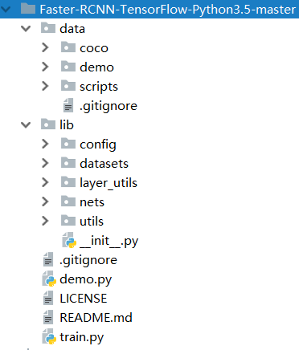
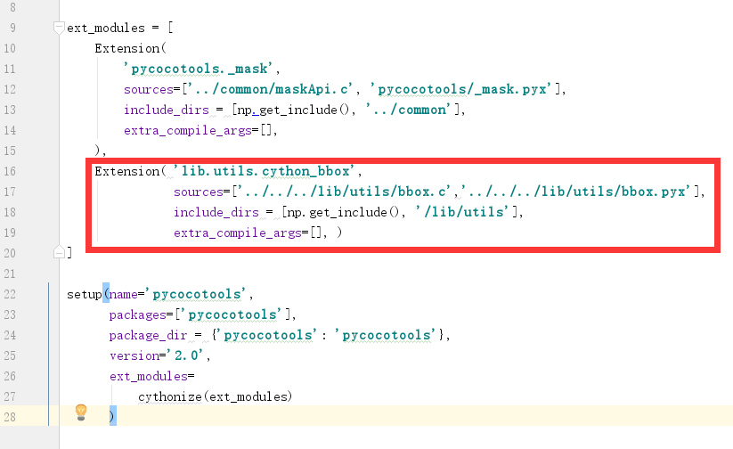
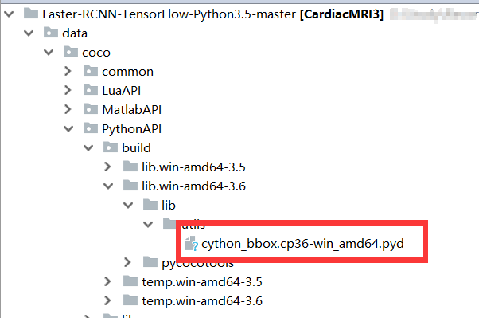
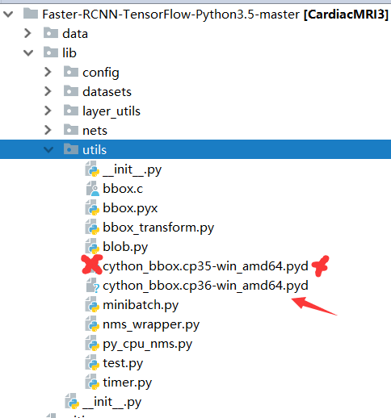
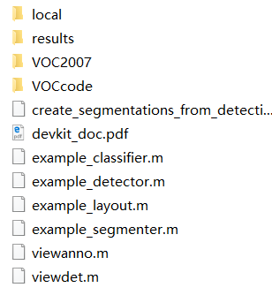

### Faster R-CNN系列（一）：配置与运行

很多人在windows上想使用GitHub上的faster rcnn进行训练会遇到各种各样的问题，在此吧整个流程和遇到的问题记录一下。

本系列主要分成两个部分：

* 在window系统上运行（训练）开源的Tensorflow版本的Faster R-CNN
* 对Faster R-CNN原理以及代码进行详细解读

1. 环境

   > windows 10
   >
   > python 3.6
   >
   > tensorflow-gpu 1.10

2. 在GitHub上下载源码

   https://github.com/dBeker/Faster-RCNN-TensorFlow-Python3.5

   **项目根目录为Faster-RCNN-TensorFlow-Python3.5-master**

   此时的项目结构：

   

3. 下载依赖包

   以下依赖包是必须的记得下载：

   ```
   pip install cython
   pip install python-opencv 
   pip install easydict
   ```

   PS: python-opencv 无法安装时可以在这个<http://www.lfd.uci.edu/~gohlke/pythonlibs/>  查找对应版本的opencv下载，并使用以下命令安装（）

   ```shell
   pip install {你刚刚下载的那个文件的路径}\{你刚刚下载的那个文件}.whl
   例如：pip install D:\tool\opencv_python-3.4.2-cp35-cp35m-win_amd64.whl
   ```

4. 修改`Faster-RCNN-TensorFlow-Python3.5-master\data/coco/PythonAPI/setup.py`文件（如果是python3.5 这一步可以省略）

   在第15行的')'后加入：

   ```python
   ,
       Extension( 'lib.utils.cython_bbox',
                  sources=['../../../lib/utils/bbox.c','../../../lib/utils/bbox.pyx'],
                  include_dirs = [np.get_include(), '/lib/utils'], 
                  extra_compile_args=[], )
   ```

   修改后（红色部分为新增内容）：

   

   在`Faster-RCNN-TensorFlow-Python3.5-master\data\coco\PythonAPI`目录下运行以下两行命令

   ```
   python setup.py build_ext --inplace
   python setup.py build_ext install
   ```

   此时`Faster-RCNN-TensorFlow-Python3.5-master\data\coco\PythonAPI\build\lib.win-amd64-3.6\lib\utils`目录下会生成一个pyd文件

   

   将其拷贝至`Faster-RCNN-TensorFlow-Python3.5-master\lib\utils`目录下，并把`cython_bbox.cp35-win_amd64.pyd`删除

   

   PS:

   这一步的操作是为了解决python 3.6版本的问题，如果是使用的3.5，可以略过这一步操作，因为`cython_bbox.cp35-win_amd64.pyd`可以直接使用，如果在3.6下没有进行以上这几步的操作，会发生异常：

   ```
   	from lib.utils.cython_bbox import bbox_overlaps
   ModuleNotFoundError: No module named cython_bbox
   ```

5. 下载数据集：

   http://host.robots.ox.ac.uk/pascal/VOC/voc2007/VOCtrainval_06-Nov-2007.tar
   http://host.robots.ox.ac.uk/pascal/VOC/voc2007/VOCtest_06-Nov-2007.tar
   http://host.robots.ox.ac.uk/pascal/VOC/voc2007/VOCdevkit_08-Jun-2007.tar

   将三个文件同时解压到`VOCdevkit2007`目录下，并将`VOCdevkit2007`目录存放于`data`目录下

   **文件名和路径结构一定要设置对，否则会报错**

   报错示例：

   ```
   'Path does not exist: {}'.format(image_set_file)
   AssertionError: Path does not exist: Faster-RCNN-TensorFlow-Python3.5-master\data\VOCdevkit2007\VOC2007\ImageSets\Main\trainval.txt
   ```

   	>Faster-RCNN-TensorFlow-Python3.5-master\data\VOCdevkit2007

   

6. 下载预训练好的VGG模型：

   <http://download.tensorflow.org/models/vgg_16_2016_08_28.tar.gz>

   解压**并改名为vgg16.ckpt(原来是vgg_16.ckpt)**后**存放在`Faster-RCNN-TensorFlow-Python3.5-master\data\imagenet_weights\`目录下**

   **如果文件没放对位置会报错：**

   ```
       c_api.TF_GetCode(self.status.status))
   tensorflow.python.framework.errors_impl.InvalidArgumentError: Unsuccessful TensorSliceReader constructor: Failed to get matching files on ./data/imagenet_weights/vgg16.ckpt: Not found: FindFirstFile failed for: ./data/imagenet_weights : ϵͳ\udcd5Ҳ\udcbb\udcb5\udcbdָ\udcb6\udca8\udcb5\udcc4·\udcbe\udcb6\udca1\udca3
   ; No such process

   During handling of the above exception, another exception occurred:

   UnicodeEncodeError: 'utf-8' codec can't encode character '\udcd5' in position 177: surrogates not allowed
   ```

   **解压后一定要改名为vgg16.ckpt 而不是vgg_16.ckpt否则会报错：**

   ```error
       if v.name.split(':')[0] in var_keep_dic:
   TypeError: argument of type 'NoneType' is not iterable
   ```

   改对名字后就可以通过。

7. 以上全都搞定以后，就可以运行train.py开始训练模型了

   每5000次迭代会在`Faster-RCNN-TensorFlow-Python3.5-master\default\voc_2007_trainval\default`目录下保存参数

   ​

   ​

   ​

   ​

   ​