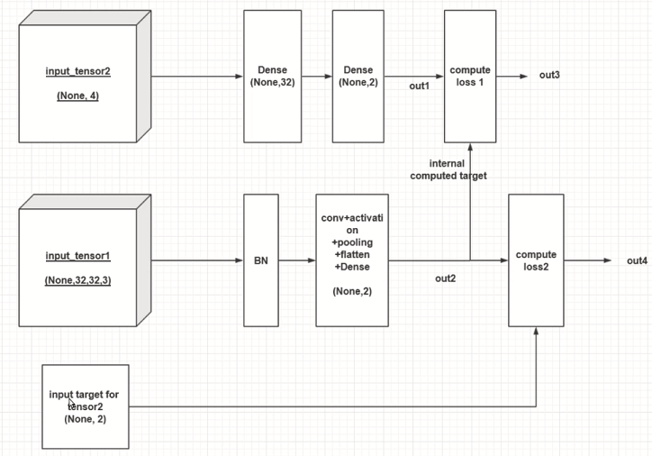

# 用keras构建多输入-多输出-多自定义loss的模型

keras 有两种模型
* Sequential 顺序模型 
* Model 函数式模型  Model(inputs,outputs,name=None)


```python
from keras import Sequential, Model
import keras.layers as KL
import keras.backend as K
import numpy as np
```

    Using TensorFlow backend.
​    

本文实现的模型


定义输入


```python
input_tensor1=KL.Input((32,32,3))
input_tensor2=KL.Input((4,))
input_target=KL.Input((2,))
```

input_tensor1 支路


```python
x=KL.BatchNormalization(axis=-1)(input_tensor1)
x=KL.Conv2D(16,(3,3),padding="same")(x)
x=KL.Activation("relu")(x)
x=KL.MaxPooling2D(2)(x)
x=KL.Conv2D(32,(3,3),padding="same")(x)
x=KL.Activation("relu")(x)
x=KL.MaxPooling2D(2)(x)   #下采样两次后 从32->8
x=KL.Flatten()(x)
x=KL.Dense(32)(x)
x=KL.Dense(2)(x)
```


```python
out2=x   #命名问题 input_tensor1 对应 out2  见上图 
```

input_tensor2 支路


```python
y=KL.Dense(32)(input_tensor2)
y=KL.Dense(2)(y)
```


```python
out1=y
```

定义模型


```python
model_temp=Model([input_tensor1,input_tensor2,input_target],[out1,out2])
```

可视化之前编写的模型
* 查看模型结构
* 文字方法表述


```python
model_temp.summary()
```

    __________________________________________________________________________________________________
    Layer (type)                    Output Shape         Param #     Connected to                     
    ==================================================================================================
    input_1 (InputLayer)            (None, 32, 32, 3)    0                                            
    __________________________________________________________________________________________________
    batch_normalization_1 (BatchNor (None, 32, 32, 3)    12          input_1[0][0]                    
    __________________________________________________________________________________________________
    conv2d_1 (Conv2D)               (None, 32, 32, 16)   448         batch_normalization_1[0][0]      
    __________________________________________________________________________________________________
    activation_1 (Activation)       (None, 32, 32, 16)   0           conv2d_1[0][0]                   
    __________________________________________________________________________________________________
    max_pooling2d_1 (MaxPooling2D)  (None, 16, 16, 16)   0           activation_1[0][0]               
    __________________________________________________________________________________________________
    conv2d_2 (Conv2D)               (None, 16, 16, 32)   4640        max_pooling2d_1[0][0]            
    __________________________________________________________________________________________________
    activation_2 (Activation)       (None, 16, 16, 32)   0           conv2d_2[0][0]                   
    __________________________________________________________________________________________________
    max_pooling2d_2 (MaxPooling2D)  (None, 8, 8, 32)     0           activation_2[0][0]               
    __________________________________________________________________________________________________
    input_2 (InputLayer)            (None, 4)            0                                            
    __________________________________________________________________________________________________
    flatten_1 (Flatten)             (None, 2048)         0           max_pooling2d_2[0][0]            
    __________________________________________________________________________________________________
    dense_3 (Dense)                 (None, 32)           160         input_2[0][0]                    
    __________________________________________________________________________________________________
    dense_1 (Dense)                 (None, 32)           65568       flatten_1[0][0]                  
    __________________________________________________________________________________________________
    dense_4 (Dense)                 (None, 2)            66          dense_3[0][0]                    
    __________________________________________________________________________________________________
    dense_2 (Dense)                 (None, 2)            66          dense_1[0][0]                    
    ==================================================================================================
    Total params: 70,960
    Trainable params: 70,954
    Non-trainable params: 6
    __________________________________________________________________________________________________


图形化可视化
* 下载graphviz 并添加 Graphviz2.38\bin 到环境变量  
* pip install pydot-ng
* 管理员权限开启jupyter notebook


```python
from keras.utils.vis_utils import plot_model
plot_model(model_temp,to_file="images/model_temp.png",show_shapes=True)
```


定义loss
* 把loss 定义成一个层 比较有条理
* keras 定义层的方法(两种)
    * 方法1  使用KL.Lambda构建层  func 为函数
      `KL.Lambda(func)(input)`
    * 方法2  继承layer并重写类实现自定义layer
      `import keras.engine as KE`


```python
#定义loss
def custom_loss1(y_true,y_pred):
    return K.mean(K.abs(y_true-y_pred))
```


```python
# s使用方法1  使用KL.Lambda构建层  func 为函数
loss1=KL.Lambda(lambda x:custom_loss1(*x),name="loss1")([out2,out1])
loss2=KL.Lambda(lambda x:custom_loss1(*x),name="loss2")([input_target,out2])
```


```python
model=Model([input_tensor1,input_tensor2,input_target],[out1,out2,loss1,loss2])
```


```python
plot_model(model,to_file="images/model.png",show_shapes=True)
```


取出loss层`model.get_layer()` 并取出loss层的输出 `model.get_layer(name).output`


```python
loss_layer1=model.get_layer("loss1").output
loss_layer2=model.get_layer("loss2").output
model.add_loss(loss_layer1)
model.add_loss(loss_layer2)
#已经add_loss 过了 所以一下可以设置为None
model.compile(optimizer='sgd',loss=[None,None,None,None])
```
