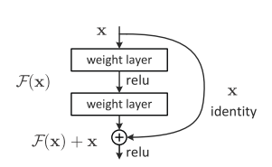

### Resnet（残差网络）

------

参考：

https://www.cnblogs.com/alanma/p/6877166.html

https://blog.csdn.net/lanran2/article/details/79057994

------

1. 问题

   训练更加深层的网络能够提取更多的特征。理论上来说会取得更好的效果。

   但是不能**简单的增加网络层数**

   * 单单增加网络的深度会导致**梯度消失**以及**梯度爆炸**的问题
     * 可以通过**正则化**或者**Batch Normalization**来解决梯度消失或者梯度爆炸等问题
   * 仅仅依靠**正则化**或者**Batch Normalization**来增加网络深度还会带来**退化问题**
     * 网络在训练集上准确率下降，很难去通过深层网络拟合目标函数

2. 核心思想

   

   对于多层网络来说，拟合**潜在的**恒等函数 $G(x)=x$ 比较困难

   将网络设计为  $H(x)=F(x)+x$ , 所以多层神经网络要学习的就是 $F(x)=H(x)-x$

   允许保留之前网络层的一定比例的输出，神经网络可以不用学习整个的输出

   而是学习上一个网络输出的残差 $F(x)=H(x)-x$ 只要 $F(x)=0$ 此时，神经网络的输出就是恒等函数。

   **网上其他解释**

   ```
   F是求和前网络映射，H是从输入到求和后的网络映射。比如把5映射到5.1，那么引入残差前是F'(5)=5.1，引入残差后是H(5)=5.1, H(5)=F(5)+5, F(5)=0.1。这里的F'和F都表示网络参数映射，引入残差后的映射对输出的变化更敏感。比如s输出从5.1变到5.2，映射F'的输出增加了1/51=2%，而对于残差结构输出从5.1到5.2，映射F是从0.1到0.2，增加了100%。明显后者输出变化对权重的调整作用更大，所以效果更好。残差的思想都是去掉相同的主体部分，从而突出微小的变化
   ```

   简而言之就是如果训练残差的话，那么主要就是注重于训练微小的变化，而不是整体。这样学习起来更加容易一些

   ​