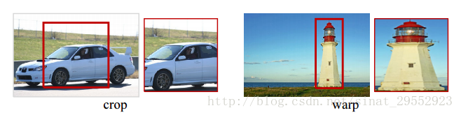
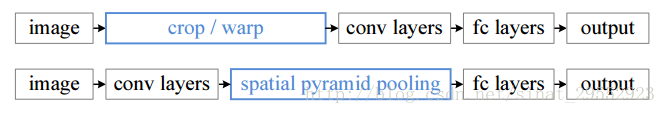
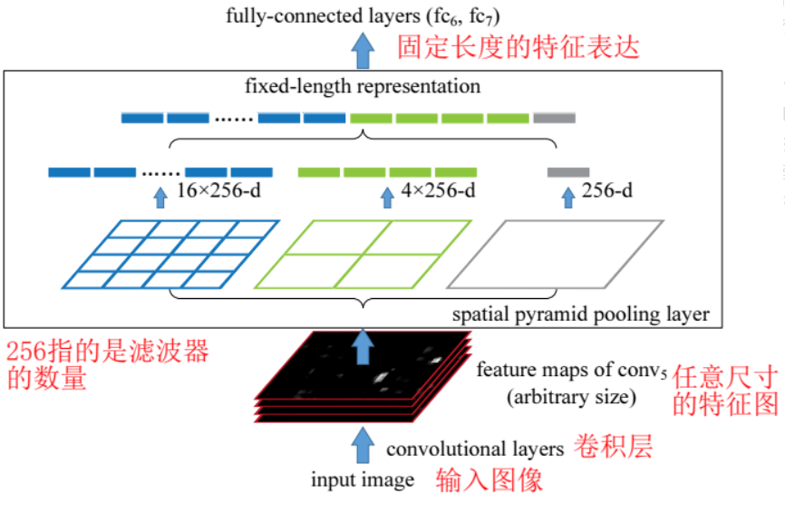

# Spatial Pyramid Pooling（空间金字塔池化）

------

图片及内容参考：

- [池化总结]: https://blog.csdn.net/sinat_29552923/article/details/72179553

- [金字塔池化过程及其优势]: https://blog.csdn.net/sinat_29552923/article/details/72638795

------

1. 目标问题

   输入图片尺寸不一，在全连接层无法进行连接

2. 优点

   1. 解决输入图片大小不一造成的缺陷
   2. feature map从不同角度进行特征提取，再聚合（算法robust）
   3. 提高目标检测的精度

3. 相关知识

   * 池化

     *  一般池化

       池化作用于图像中不重合的区域

     * 重叠池化

       相邻池化窗口之间会有重叠区域（size>stride）

     * Spatial Pyramid Pooling

       可以把任何尺度的图像的卷积特征转化成相同维度

   * crop，warp

     * crop（修剪）：会损失图像信息

     * warp：会扭曲图像

       

4. 空间金字塔池化

   在全连接层之前加上SPP层

   

   具体结构

   

   SPP采用了三种池化,**他们步长和窗口大小有输入图片决定 **,通过针对不同尺寸的图片，使用不同大小的stride以及窗口大小，使得最后的结果为生成三个池化层，分别为： $$   \{ 4*4,2*2,1*1\} $$

   最后输出的特征数为:  $$(4*4+2*2+1)*\#channels$$  , 图中通道数为256 $$(\#channels=256)$$

   ​

5. 参考

   * [池化总结]: https://blog.csdn.net/sinat_29552923/article/details/72179553

   * [金字塔池化过程及其优势]: https://blog.csdn.net/sinat_29552923/article/details/72638795

     ​

     ​